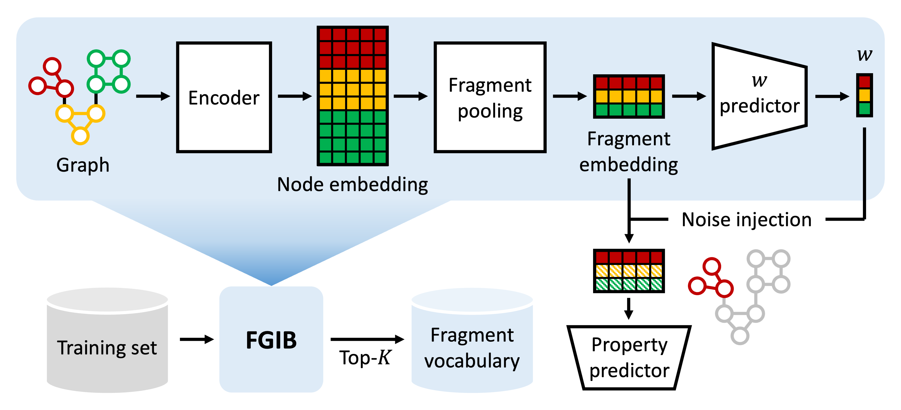
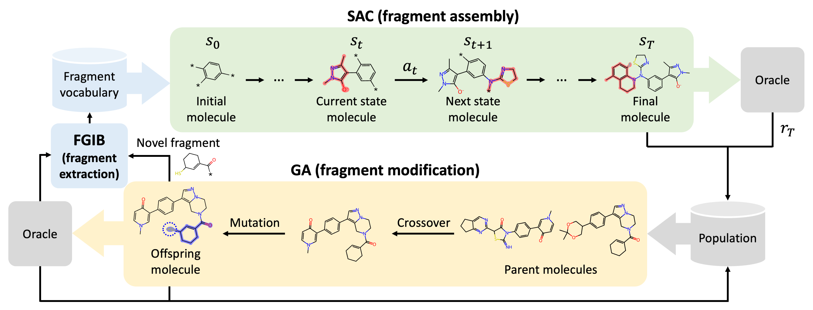

<h1 align="center">Drug Discovery with Dynamic Goal-aware Fragments</h1>

This is the official code repository for the paper [Drug Discovery with Dynamic Goal-aware Fragments](https://arxiv.org/abs/2310.00841) (ICML 2024).<br>
In our paper, we introduce:
+ *Fragment-wise Graph Information Bottleneck (FGIB)*, a novel goal-aware fragment extration method using the GIB theory to construct a fragment vocabulary for target chemical properties.
    <p align="center">
        
    </p>

+ *Goal-aware fragment Extraction, Assembly, and Modification (GEAM)*, a generative framework consists of FGIB, soft-actor critic (SAC), and genetic algorithm (GA), each responsible for fragment extraction, fragment assembly, and fragment modification.

    <p align="center">
        
    </p>

## Installation
Run the following commands to install the dependencies:
```bash
conda create -n geam python==3.7
conda activate geam
conda install cudatoolkit=10.2
pip install torch==1.8.1+cu102 -f https://download.pytorch.org/whl/torch_stable.html
pip install torch-scatter==2.0.8 torch-sparse==0.6.12 torch-cluster==1.5.9 -f https://data.pyg.org/whl/torch-1.8.1+cu102.html
pip install torch-geometric==2.0.4 rdkit requests urllib3==1.26.6 more_itertools gym==0.18
conda install -c conda-forge openbabel
conda install -c dglteam dgl-cuda10.2==0.8
```

## Preprocessing
Run the following command to preprocess the ZINC250k dataset:
```bash
python utils_fgib/data.py
```

## Training FGIB
We provide the pretrained FGIB for target proteins parp1, fa7, 5ht1b, braf, and jak2, respectively (`parp1.pt`, `fa7.pt`, `5ht1b.pt`, `braf.pt`, and `jak2.pt`, respectively), in the folder `ckpt`.

To train your own FGIB, run the following command:
```bash
python train_fgib.py -g ${gpu_id} -t ${target}
# e.g., python train_fgib.py -g 0 -t parp1
```

## Constructing Initial Fragment Vocabulary
We provide the initial fragment vocabularies for target proteins parp1, fa7, 5ht1b, braf, and jak2, respectively (`parp1.txt`, `fa7.txt`, `5ht1b.txt`, `braf.txt`, and `jak2.txt`, respectively), in the folder `data`.

To construct the initial fragment vocabulary from scratch, run the following command:
```bash
python get_frags.py -g ${gpu_id} -t ${target} -m ${gib_path} -v ${vocab_path}
# e.g., python get_frags.py -g 0 -t parp1 -m ckpt/parp1.pt -v data/parp1.txt
```

## Generating Molecules with GEAM
To generate molecules with GEAM, run the following command:
```bash
python run.py -g ${gpu_id} -t ${target} -m ${gib_path} -v ${vocab_path}
# e.g., python run.py -g 0 -t parp1 -m ckpt/parp1.pt -v data/parp1.txt
```

## Evaluating Generated Molecules
To evaluate the generated molecules, run the following command:
```bash
python eval.py ${file_name} -t ${target}
# e.g., python eval.py results/file_name.csv -t parp1
```

## Citation
If you find this repository and our paper useful, we kindly request to cite our work.
```BibTex
@article{lee2024GEAM,
  author    = {Seul Lee and Seanie Lee and Kenji Kawaguchi and Sung Ju Hwang},
  title     = {Drug Discovery with Dynamic Goal-aware Fragments},
  journal   = {Proceedings of the 41th International Conference on Machine Learning},
  year      = {2024}
}
```
